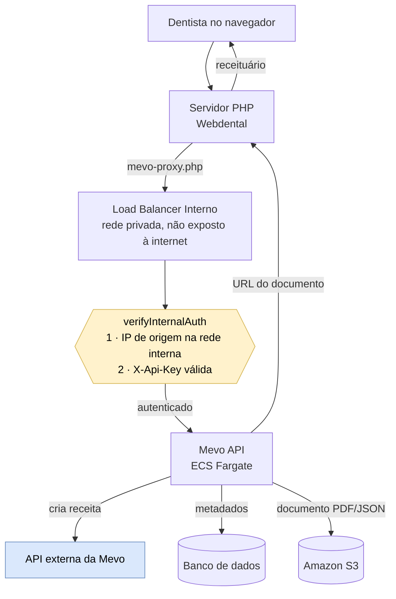
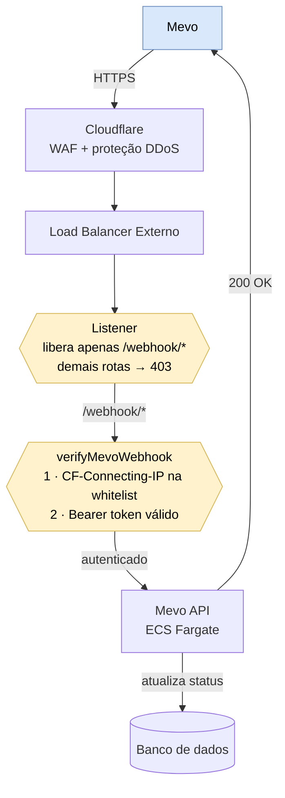

# Arquitetura

A Mevo API possui **duas rotas de entrada independentes**, cada uma com seu próprio ALB e middleware de autenticação:

- **Rota interna** — backend PHP do Webdental gerando receituários, via ALB Internal (tráfego nunca sai da VPC), autenticada pelo middleware `verifyInternalAuth`
- **Rota externa** — webhook da Mevo, via Cloudflare Proxy + ALB External, autenticada pelo middleware `verifyMevoWebhook`

## Diagramas

### Fluxo interno — geração de receituário

### Fluxo do webhook — notificações da Mevo

> Os diagramas são conceituais (sem IDs de recurso). No fluxo do webhook, as duas caixas amarelas — **listener** e **`verifyMevoWebhook`** — são as duas camadas que protegem as rotas internas de exposição pela internet. Para os nomes reais dos recursos, veja [Infraestrutura](infraestrutura.md).

## Comparação entre ambientes

| Aspecto | Staging (sa-east-1) | Produção (us-east-1) |
|---|---|---|
| Acesso à internet da task | Subnet pública, `assignPublicIp: ENABLED` | Subnet privada + NAT Gateway (IP de saída fixo) |
| VPC Endpoints | Compartilhados com Mensageria | Dedicados (`logs`, `ecr.api`, `ecr.dkr`, `s3`) |
| Custo estimado | ~$9/mês | ~$80–100/mês (NAT Gateway + VPC Endpoints + ALB) |
| ALB External | `hmg-mevo-alb` | `prd-mevo-alb` |
| ALB Internal | `hmg-mevo-alb-internal` | `prd-mevo-alb-internal` |
| DNS Internal | `internal-hmg-mevo-alb-internal-1641981751.sa-east-1.elb.amazonaws.com` | `internal-prd-mevo-alb-internal-1961577618.us-east-1.elb.amazonaws.com` |
| Target Group interno | `hmg-mevo-internal-target-group` (HTTP:3000) | `prd-mevo-internal-target-group` (HTTP:3000) |
| Tasks | 1 | 2 base — Auto Scaling min 2, max 5, CPU 70% |
| Rede da task | Subnet pública (`assignPublicIp: ENABLED`) | Subnet privada + NAT Gateway |
| Cloudflare | Proxied | Proxied |
| Header de IP real (webhook) | `CF-Connecting-IP` | `CF-Connecting-IP` |

## Decisões relevantes

- **ALB Internal em HTTP:80 sem TLS** — aceitável porque o tráfego nunca sai da VPC; nenhuma exposição pública.
- **`mevo-config.php` não versionado** — o servidor PHP resolve endpoint + API Key em runtime, fora do Git.
- **Cache de SSM/secrets em memória por task** — funciona com 1 task; com Auto Scaling ativo há inconsistência entre tasks. Migração para Valkey/ElastiCache (`app-valkey-webdental-prod`) é pendência registrada.

## Decisões arquiteturais

| Decisão | Escolha | Motivo |
|---|---|---|
| Compute | ECS Fargate | Projeto já estruturado em Express/Node, zero refatoração, custo baixo |
| Storage de documentos | Amazon S3 | Padrão de mercado para binários, custo mínimo, versionamento para LGPD |
| JSON de retorno | S3 + referência no MariaDB | JSON grande não deve ficar em banco relacional |
| Dados analíticos | MariaDB BD01 (existente) | Campos indexáveis para relatórios futuros |
| Credenciais em Fargate | IAM Role na Task Definition | Sem Access Keys no código — padrão de segurança AWS |
| Credenciais em dev local | Access Keys no `.env` (opcional, só com storage S3) | Nunca commitadas; o dev acessa apenas o bucket de staging. Com storage local, dev roda sem AWS |
| Cluster ECS | 1 cluster por projeto | Isolamento, autonomia de deploy, preparação para IaC |
| Rota interna | ALB Internal + `verifyInternalAuth` | Tráfego não sai da VPC; autenticação no middleware |
| Autenticação do webhook | Bearer token + whitelist de IP | Rápido de implementar; HMAC como evolução futura |
